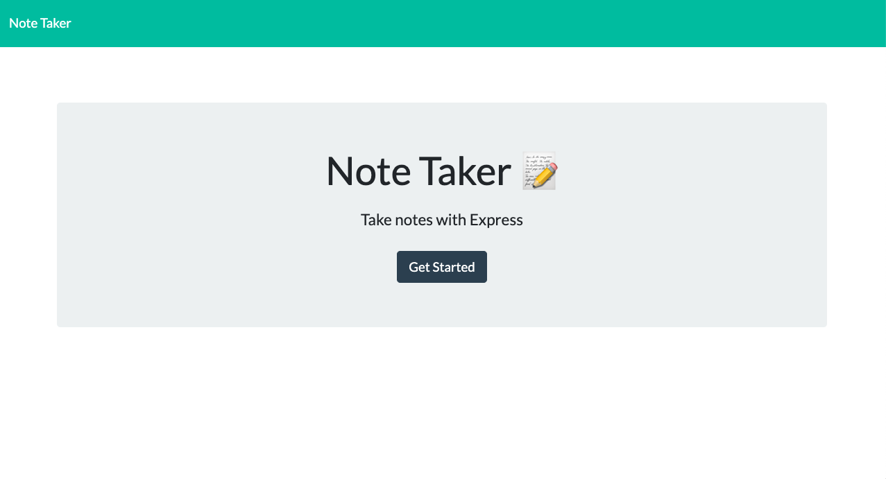
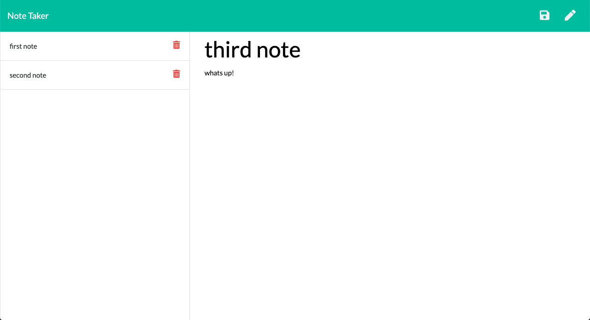

# Express Note Taker 

## Table of Contents 

  - [Description](#description)
  - [Installation](#installation)
  - [Usage](#usage)
  - [Contribution](#contribution)
  - [Questions](#questions)
  
  ## Description:
  
  This application allows users to write, save, and delete notes. 

  

  ## Installation:
  No installation required, simply visit: https://note-app-taker.herokuapp.com/
  ## Usage:
  
  
  
  The user must click 'get started' to initialize this application. Then they will have an an empty text field to enter both a title and a note of their choice. To save their note, the user must click on the save button (floppy disc icon). Any saved notes will have their titles appear on the sidebar of the page. To view any previous notes, the user must click on the note title in the sidebar. To delete any notes, the user must click the delete button (trashcan icon). If the user decides to create a new note, they must click on the compose button (pencil icon).  

  ## Contribution
  Andres Roldan

  ## Questions
  For more questions about the Generator, please contact me at:
  
  * [Github Profile](http://github.com/dresroldan)
  * dresroldan@gmail.com
      
  
